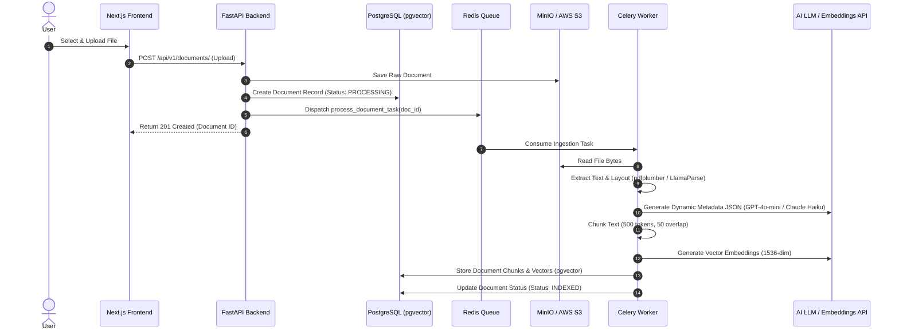
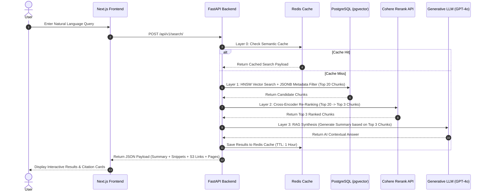

# System Architecture & Multi-Tenant Security Design

## 1. System Overview

The **Multi-Tenant AI Document Management & Search Platform (DMS)** is designed for scalable, tenant-isolated document ingestion, asynchronous parsing, vector embedding generation, and hybrid Retrieval-Augmented Generation (RAG) search.

```
                         ┌────────────────────────────────────────┐
                         │       Next.js 14 Web Frontend         │
                         │    (Port 3000 | React 18 + Tailwind)   │
                         └───────────────────┬────────────────────┘
                                             │ HTTP REST / JSON
                                             ▼
                         ┌────────────────────────────────────────┐
                         │        FastAPI Async Backend           │
                         │       (Port 8000 | Python 3.11)        │
                         └───────┬───────────┬────────────┬───────┘
                                 │           │            │
             Async Task Push     │           │ SQL (async)│ S3 Presigned / Direct API
             ┌───────────────────┘           │            └─────────────────────────┐
             ▼                               ▼                                      ▼
┌─────────────────────────┐     ┌──────────────────────────┐             ┌─────────────────────────┐
│     Redis 7.0 Store     │     │  PostgreSQL 16 + pgvector│             │   MinIO / AWS S3 Storage│
│ (Celery Queue + Cache)  │     │   (HNSW Vector Indexing) │             │ (Tenant Bucket Isolation)│
└────────────┬────────────┘     └────────────▲─────────────┘             └─────────────────────────┘
             │                               │
             ▼ Task Consumption              │ Vector Writes / Queries
┌─────────────────────────┐                  │
│  Celery Worker Process  ├──────────────────┘
│ (Async Document Parsing)│
└────────────┬────────────┘
             │ Task Telemetry
             ▼
┌─────────────────────────┐
│ Flower Task Dashboard   │
│       (Port 5555)       │
└─────────────────────────┘
```

---

## 2. Core Architectural Components

### 2.1 Web Frontend (Next.js 14)
- **Framework**: Next.js 14 (App Router) with React 18 & TypeScript.
- **Styling**: Tailwind CSS with custom dark mode glassmorphism UI components.
- **Client Processing**: Browser-side document previews (`mammoth.js` for `.docx`, `xlsx` for spreadsheets, native PDF viewer).
- **Communication**: REST API over HTTPS with JWT bearer token authentication.

### 2.2 Application Server (FastAPI)
- **Framework**: FastAPI with Uvicorn worker process.
- **Asynchronous Execution**: Native Python `asyncio` for non-blocking I/O operations (database queries, Redis operations, and S3 file signed link generation).
- **Rate Limiting**: `SlowAPI` middleware enforcing rate limits per user (`60/min`) and per tenant (`1000/min`).
- **Audit Logging**: `ApiLoggingMiddleware` records all user access, document interactions, search queries, and administrative actions into the PostgreSQL audit log.

### 2.3 Task Queue & Background Workers (Celery + Redis)
- **Message Broker**: Redis 7.0 database (Port `6379`).
- **Worker Execution**: Celery background worker processes running async parsing pipelines (`app.tasks.worker.process_document_task`).
- **Monitoring**: Celery Flower dashboard (Port `5555`) providing live process execution tracking, queue depth analysis, and retry telemetry.

### 2.4 Vector & Relational Database (PostgreSQL + `pgvector`)
- **Database Engine**: PostgreSQL with `pgvector` extension.
- **Indexing Strategy**: HNSW (Hierarchical Navigable Small World) cosine similarity index for sub-millisecond vector similarity search over high-dimensional embeddings (1536 dimensions).
- **Relational Data**: Structured metadata, tenant definitions, user credentials, folder hierarchy, audit logs, and document chunk references.

### 2.5 Object Storage (MinIO / AWS S3)
- **Interface**: AWS S3 API-compatible storage (MinIO for local dev, AWS S3 for production).
- **Privacy Model**: No direct public HTTP access to documents. Files are fetched exclusively via temporary S3 pre-signed URLs (default expiration: 900 seconds).

---

## 3. Multi-Tenant Security & Isolation Model

Data separation and tenant isolation are guaranteed across every layer of the architecture:

```
User Request (JWT with Tenant ID)
  │
  ├─► FastAPI JWT Middleware (Validates Tenant Claim & Expiry)
  │
  ├─► Database Layer (PostgreSQL Row-Level Security / RLS)
  │     └─► Enforces: WHERE tenant_id = 'current_tenant_id'
  │
  └─► Object Storage Layer (S3 Key Prefix Isolation)
        └─► Path: s3://docsearch-documents/{tenant_id}/{document_id}/{filename}
```

### 3.1 Row-Level Security (RLS) & Database Queries
- Every document, chunk, folder, and audit log table contains a mandatory `tenant_id` foreign key (`UUID`).
- SQLAlchemy ORM dependencies automatically filter queries by the authenticated user's `tenant_id`.
- Foreign key constraints prevent cross-tenant object association.

### 3.2 S3 Bucket Partitioning
- S3 objects are isolated by key prefixing: `{tenant_id}/{document_id}/{file_name}`.
- Pre-signed URL generation validates that the requesting user's tenant owns the requested document before returning access credentials.

### 3.3 JWT Authentication & Access Control
- Passwords stored using bcrypt password hashing.
- Tokens issued with 15-minute access token expiration and 7-day refresh tokens.
- Admin endpoints require explicit super-admin privileges verified via role-based access checks (`require_admin`).

---

## 4. End-to-End Ingestion Flow



---

## 5. End-to-End Retrieval Flow (4-Layer Hybrid Search)


